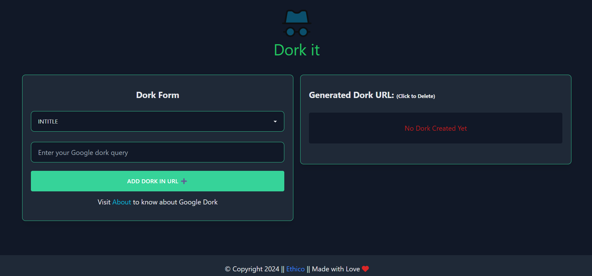

# Dork IT

This is a simple Open Source React web application that allows you to create Google search queries using various Google dork types. It provides a user-friendly interface.


## Features

- Add Google dorks with different types such as intitle, inurl, intext etc.
- Generate a URL based on the selected dorks.
- Open the generated URL in a new tab for performing a Google search.
- User can add and delete the dork data.
- Dork data will be saved in your localstorage until you manually delete it.

## Getting Started

Use the site in [Dork IT Website](https://dorkit.netlify.app/) or follow the instructions :

1. Clone this repository to your local machine:

   ```bash
   git clone https://github.com/Shariar-Hasan/Dork-IT.git
   ```

2. Navigate to the project directory:

   ```bash
   cd Dork-IT
   ```

3. Install the required dependencies:

   ```bash
   npm install
   ```

4. Start the development server:

   ```bash
   npm start
   ```

5. Open your web browser and visit [http://localhost:3000](http://localhost:3000) to use the Google Dork Search webpage.

## Usage

1. Select a dork type from the dropdown list (e.g., intitle, inurl, etc.).
2. Enter your Google dork query in the text input field.
3. Click the "Add Dork in URL" button to add the dork to the URL.
4. The generated URL will be displayed on the right side of the webpage.
5. Click Search Button to open the URL in a new tab and perform a Google search.

<h3 align="center">Happy Dorking!!</h3>
